# Table of contents

1. [Introduction](#introduction)
    * [Objective](#objective)
    * [User stories](#users)
    * [Wireframes](#wireframes)
    * [Design Notes](#design)
2. [UX](#design)
3. [Features](#features)
    * [Existing Features](#existing_feat)
    * [Features left to implment](#future_feat)
4. [Information Architecture](#models)
5. [Technologies Used](#technologies)
6. [Testing](#testing)
7. [Deployment](#deploying)
    * [Run Locally](#local)
    * [Deploy to Heroku](#heroku)
8. [Credits](#credits)
    * [Content](#content)
    * [Media](#media)
    * [Acknowledgements](#acknowledgements)

# Introduction <a name="introduction"></a>

## Objective <a name="strategy"></a>

* To sell trips to outer space

## User Stories <a name="users"></a>

"As a user, I would like to \_\_\_\_\_\_\_\_\_\_\_"

* As a user, I would like to view the different types of trips available
* As a user, I would like to view individual trips in more detail
* As a user, I would like to book my place on a trip
* As a user, I would like to provide details of the number of passengers and passenger information
* As a user, I would like to review my booking before placing it
* As a user, I would like to easily Enter Payment information
* As a user, I would like to feel my personal and payment information is secure
* As a user, I would like to view my order confirmation after checkout
* As a user, I would like to receive a confirmation email after the checokout is complete
* As a user, I would like to modifiy my booking details
* As a user, I would like to view my bookings

"As a business user, I would like to"

* As a buisness owner I would like to add new trips and experiences
* As a buisness owner I would like to view the number of seats available for each trip

## Wireframes <a name="wireframes"></a>
### Base Skeleton  

+ The pager header, containing the navigation links and company logo, is anchored to the top of the viewport window and has a high z-index so that the page content scrolls behind it.

+ When the entire body fits within the viewport height, the footer anchors to bottom of the screen while the main content 'grows' to fill the remaining space.

+ If the main content overflows the viewport height, the content becomes scrollable and the footer is positioned as per default, in the normal flow of the page.  

+ The content is structured using Bootstrap's Grid System. On all screen sizes, the containing elements - **header**, **main**, and **footer** are given the class **"container-fluid"** so that the background extends accross the full width of the screen.

+ The content within the **header** and **main** elements is contained within a content column. This is a full width column (**"col-12"**) on small devices, but reduced to 83.33\% width on viewports wider than 991px, to allow a margin on the left and right of content (**"col-md-10"**)

+ On all devices, the content column within the footer is set to (**"col-12"**) which gives the page a solid base.

&nbsp;
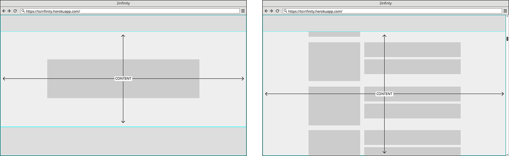

&nbsp;
### Landing Page  

+ The layout of the landing page is minimalistic and draws the user directly to the hero button which offers a starting point for their navigation of the site.

+ The page is filled with a dynamic full screen background image of the Earth
photographed from space. The image is fixed so that image appears to zoom in and out when the viewport is resized but keeps its position on the page. 

+ The font family used for the hero text is **'Euphoria Script'**. It was chosen to contrast the main font for added interest. It is set to a large font size for maximum impact and legibility and given a text shadow which matches the base teal colour chosen for the site.

+ On all devices, the entire template fits within the viewport so the user will be able to access everything without the need to scroll.

+ The base teal colour is used to catch the eye as it stands out againt the dark theme. In this template, it is used in the header section to underline the hovered navigation links, in the main section for the hero button and effect on the hero text, and for footer. This keeps the overall template nicely balanced.

&nbsp;
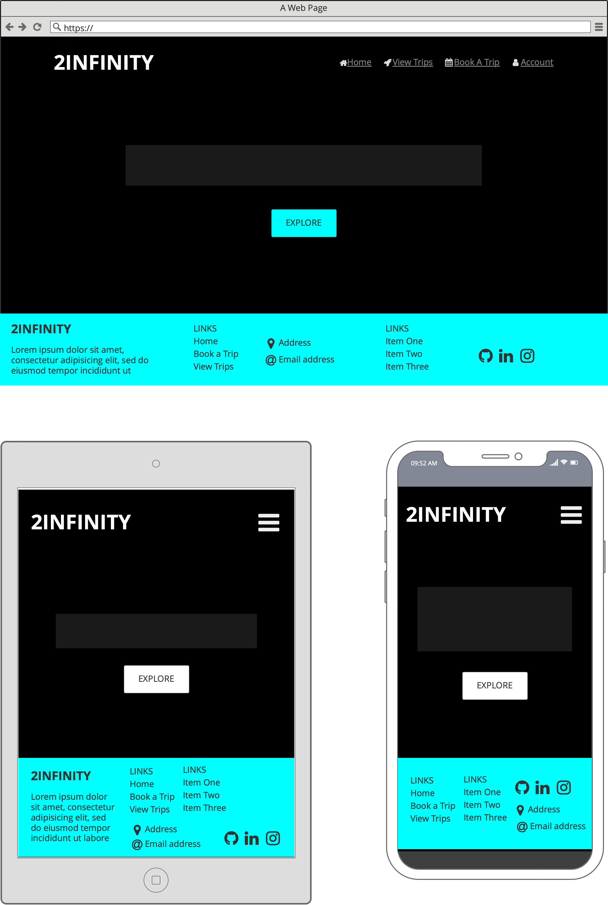


&nbsp;
### AllAuth Templates 

+ The templates to sign in, sign up and sign out all conform to the base structure of the app; The header is anchored at the top and the main content is centered vertically and horizontally, filling the space between the header and the footer at the bottom of the screen.

+ The individual forms are the only features of their respective templates and are styled as per the form style.

+ On larger screen sizes the forms are contained by a 1px solid border in the base teal colour. On mobile devices, the border is removed as viewport comfortably takes over as the form's 'container'.

&nbsp;
#### Sign Up   

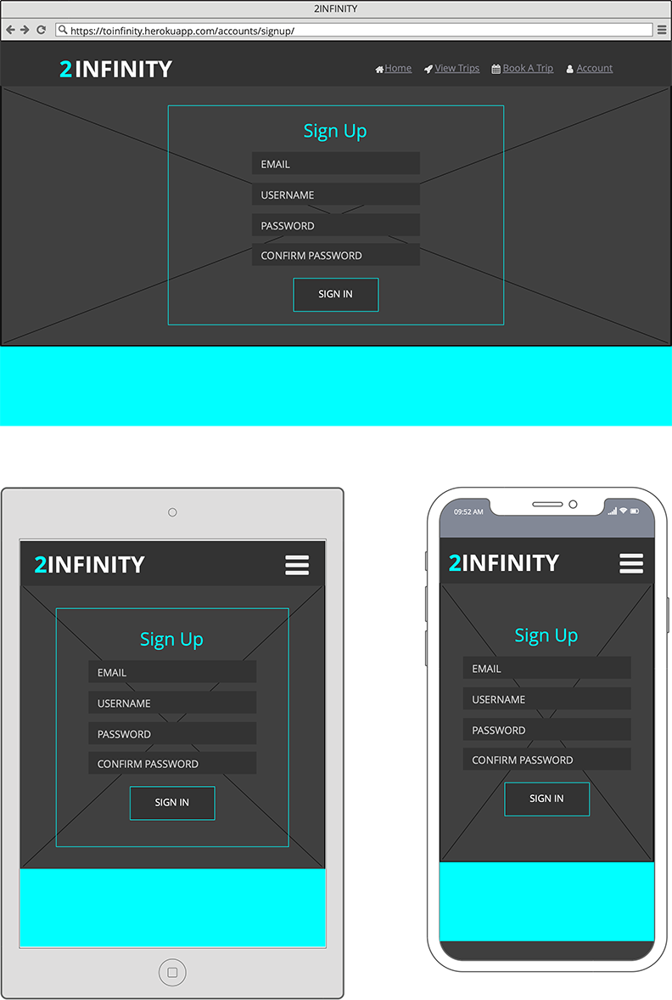

&nbsp;
#### Sign In    


&nbsp;
#### Sign Out    
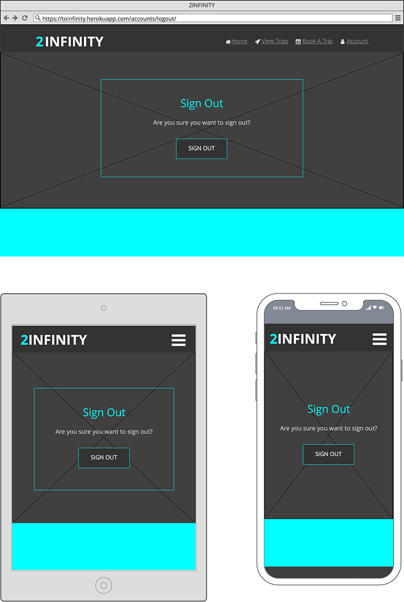


&nbsp;
### View Trips

+ 

&nbsp;


&nbsp;
### Destination Detail

+ 

&nbsp;


&nbsp;
### Book A Trip

+ The template features a progress bar just beneath the main navigation bar. As this is the first step in the booking process, the first icon is highlighted in the highlight colour, whereas the rest of the icons are greyed out and disabled. This will enable the user to track where they are in the booking process.

+ On smaller screen sizes, the sizes of the progress bar icons reduces slightly in proportion to the smaller space.

&nbsp;
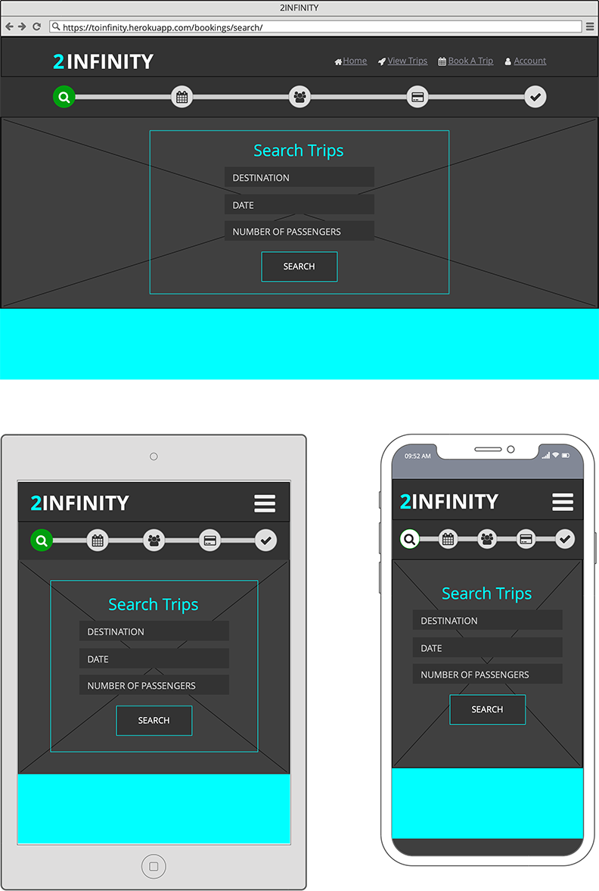

&nbsp;
### Confirm Trip

+ The template features the progress bar which reflects that the user has reached the second step in the booking process; the first and second icon are highlighted in the highlight colour, whereas the rest of the icons are greyed out.

+ The first step in the progress bar is an active link back to the Search Trips template.

+ Just as in the "Book A Trip" template, the size of the progress bar icons is reduced on smaller screens.

+ The form contains one field; a set of radio input options based on the available dates for the destination and number of passengers requested. The set of options is also refined to the dates closest to the date the user provides in their search.  

+ The radio buttons are hidden in favor of custom styled input labels which display the date, and cost per traveller.

+ When the option is submitted, a model is triggered to confirm that the choices that the passenger has made.

&nbsp;
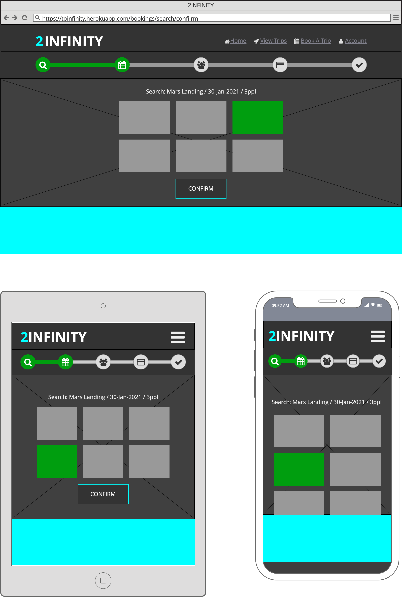

&nbsp;
### Passenger Details

+ 

&nbsp;
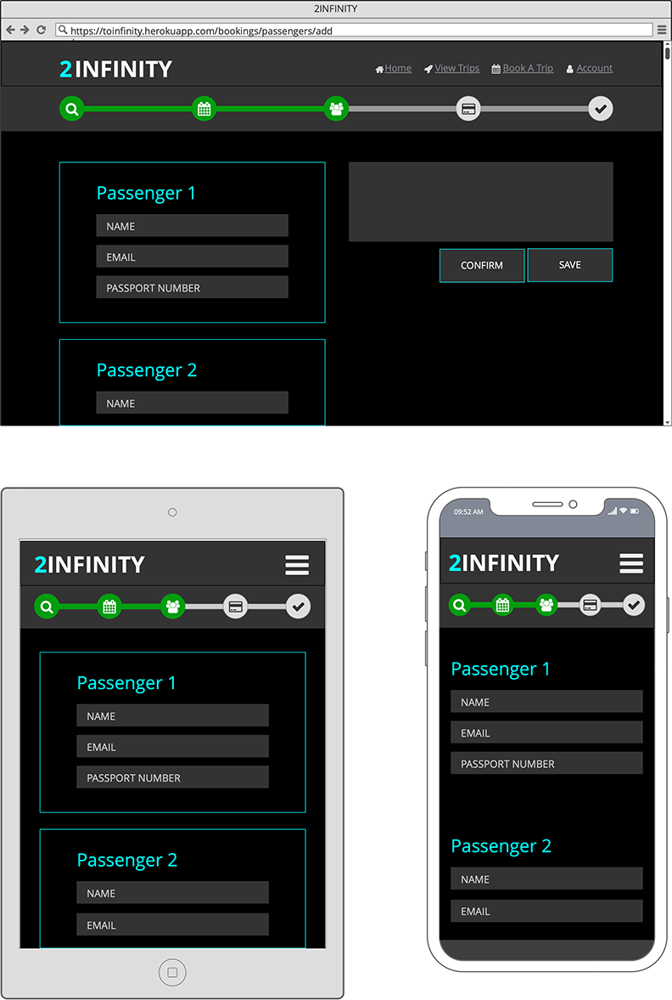

&nbsp;
### Checkout

+ 

&nbsp;
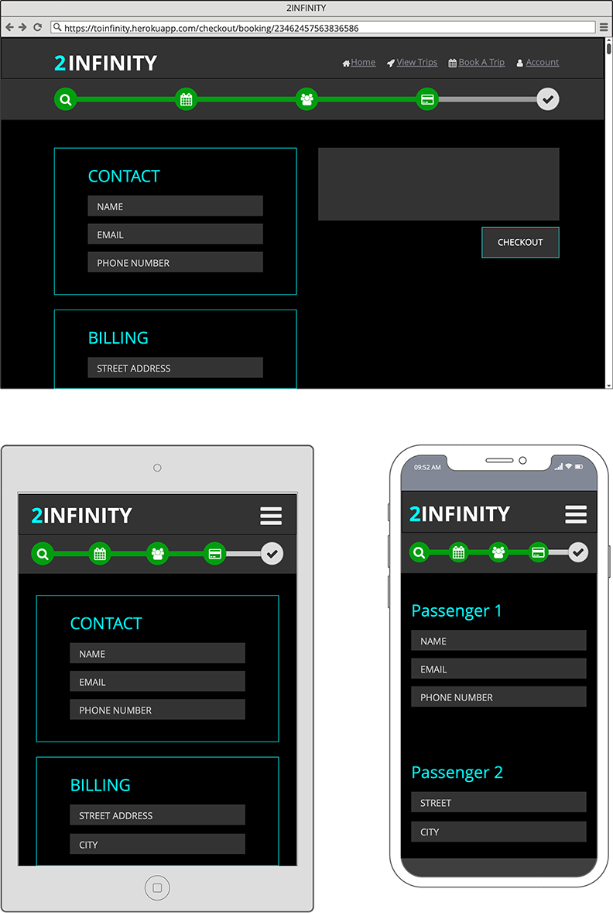


&nbsp;
### Checkout Success

+ 

&nbsp;
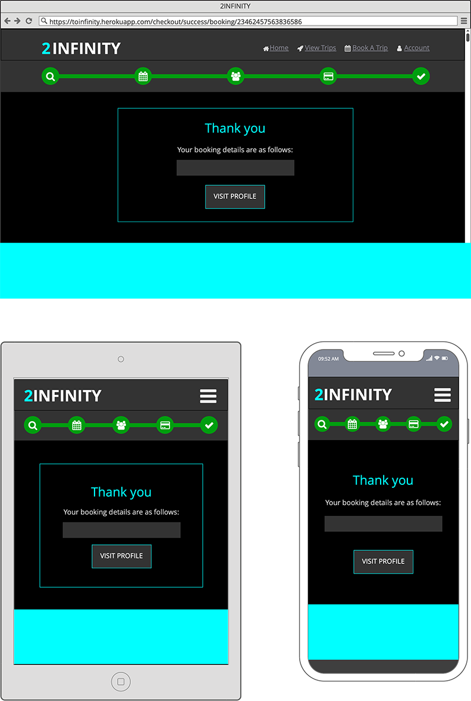

&nbsp;
### User Profile

+ 

&nbsp;
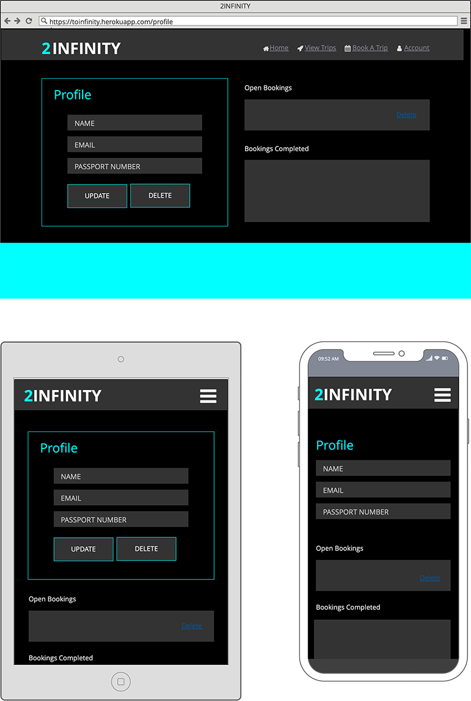

## Design Notes <a name="design"></a>

### Typography

+ The main fonts used in this app are **"Orbitron,"** and **"Montserrat"** from google fonts.


# Information Architecture <a name="models"></a>

## Models

- - -

## Profile

### Profile:

| Name | Key in db | Field Type | Options |
| ---- | --------- | ---------- | ------- |
| User | user | OneToOneField(User) | on\_delete=CASCADE |
| First Name | default\_first\_name | CharField | max\_lenghth=80, null=False, blank=False |
| Last Name | default\_last\_name | CharField | max\_length=80, null=False, blank=False |
| Address 1 | default\_address1 | CharField | max\_length=80, null=True, blank=True |
| Address 2 | default\_address2 | CharField | max\_length=80, null=True, blank=True |
| Postcode | default\_postcode | CharField | max\_length=20, null=True, blank=True |
| City | default\_town\_or\_city | CharField | max\_length=40, null=True, blank=True |
| Country | default\_country | CountryField | blank\_label="Country", null=True, blank=True |
| Medical Rating | default\_medical\_rating | IntegerField | null=true, blank=True |

- - -

Booking

&nbsp;
### Trip:

| Name | Key in db | Field Type | Validation |
| ---- | --------- | ---------- | ---------- |
| Destination | destination | ForeignKey(Destination) | null=True, blank=False, on\_delete=SET\_NULL |
| Date | date | DateField |  |
| Seats Available | seats\_available | IntergerField | null=False, blank=False, editable=False |

### Booking:

| Name | Key in db | Field Type | Validation |
| ---- | --------- | ---------- | ---------- |
| Booking Reference | booking\_ref | CharField | primary\_key=True, max\_length=20, null=False, editable=False |
| Trip | trip | ForeignKey(Trip) | on\_delete=SET\_NULL, null=False, blank=False |
| Lead User | lead\_user | ForeignKey(UserProfile) | on\_delete=SET\_NULL, null=True, blank=True |
| Booking Total | booking\_total | DecimalField | max\_digits=10, decimal\_places=2, null=False, default=0 |
| Stripe Payment ID | stripe\_pid | CharField | max\_length=254, null=False, blank=False default="" |
| Full Name | full\_name | TextField | max\_length=50, null=False, blank=False |

### Passengers:

| Name | Key in db | Field Type | Validation |
| ---- | --------- | ---------- | ---------- |
| Booking | booking | ForeignKey(Booking) | on\_delete=CASCADE, |
| First Name | first\_name | CharField | on\_delete=SET\_NULL, null=False, blank=False |
| Last Name | last\_name | CharField | on\_delete=SET\_NULL, null=True, blank=True |
| Email | email | EmailField | max\_length=254, null=False, blank=False |
| Medical Assessment | medical\_assessment | OneToOneField(Medical) | on\_delete\_CASCADE, null=True, blank=True |
| Medical Rating | medical\_rating | IntegerField | max\_digits=3, null=False, blank=False, default=0 |

### Booking Line Items:

| Name | Key in db | Field Type | Validation |
| ---- | --------- | ---------- | ---------- |
| Booking | booking | ForeignKey(Booking) | on\_delete=SET\_NULL, null=False, blank=False, on\_delete=CASCADE |
| Product | product | OneToOneField(Product) | on\_delete=SET\_NULL, null=False, blank=False, on\_delete=CASCADE |
| Quantity | quantity | IntegerField | null=False, blank=False, default=0 |
| Line Total | line\_total | DecimalField | max\_digits=7, decimal\_places=2, null=False, blank=False, editable=False |

- - -

## Products

### Product:

| Name | Key in db | Field Type | Validation |
| ---- | --------- | ---------- | ---------- |
| Category | category | ForeignKey(Category) | null=True, blank=True, on\_delete=SET\_NULL |
| Name | name | CharField | max\_length=254 |
| Product ID | product\_id | CharField | max\_length=254 |
| Description | description | TextField |  |
| Price | price | DecimalField | max\_digits=6, decimal\_places=2 |
| Image | image | ImageField | null=True, blank=True |
| Image URL | image\_url | URLField | max\_length=1024, null=True, blank=True |
| Image Thumbnail | image\_thumb | ImageField | null=True, blank=True |

### Category:

| Name | Key in db | Field Type | Validation |
| ---- | --------- | ---------- | ---------- |
| Name | name | CharField | max\_length=75 |
| Friendly Name | friendly\_name | CharField | max\_length=75, blank=True |

### Destination (Product):

| Name | Key in db | Field Type | Validation |
| ---- | --------- | ---------- | ---------- |
| Maximum Passengers | max\_passengers | IntegerField |  |
| Duration | duration | CharField | max\_lenght=20 |
| Minimal Medical Threshold | min\_medical\_threshold | IntegerField | blank=True |

### Add-On (Product):

| Name | Key in db | Field Type | Validation |
| ---- | --------- | ---------- | ---------- |
| Minimal Medical Threshold | min\_medical\_threshold | IntegerField |  |

### Insurance (Product):

| Name | Key in db | Field Type | Validation |
| ---- | --------- | ---------- | ---------- |
| Friendly Name | friendly\_name | CharField | max\_length=75, blank=True |

- - -

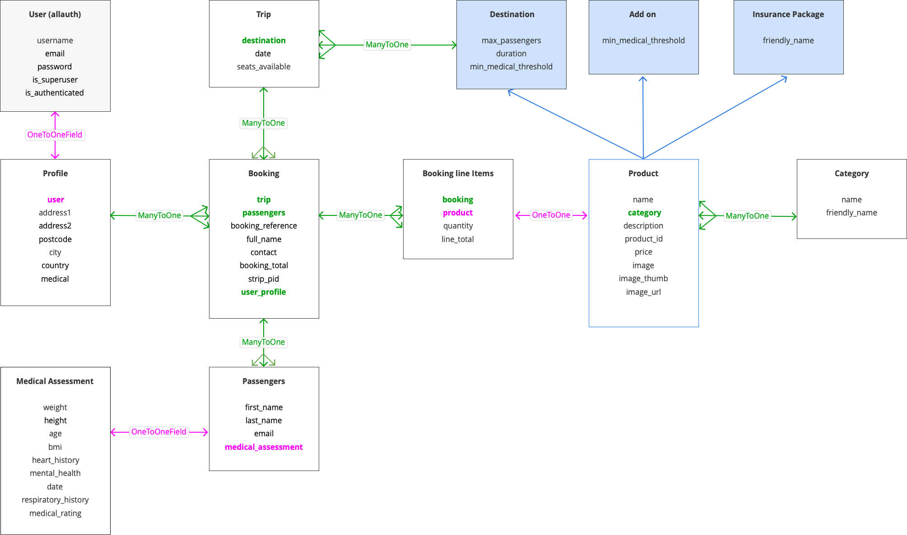

# Deployment <a name="deploying"></a>

## Run Locally <a name="local"></a>

> In order to run the project locally, you will need an IDE, PIP, Python (version 3) and Git installed.
> You will need to set up a free account with Stripe and with AWS for a S3 bucket.

1. Visit the 2infinity repository on Github; [https://github.com/fdeboo/to-infinity](https://github.com/fdeboo/to-infinity) and click on  to clone or download it.
2. Either:
***or***

```
  git clone https://github.com/fdeboo/to-infinity.git
```

* Click to **Download Zip** and save the folder somewhere on your local system
    * File > Open the project from within your IDE
    * Copy the web url. In the terminal of your IDE, change directory / `cd` to where you want the project saved on your system.
    * Type `git clone` and paste in the copied web url to complete the command *(as below)*:
3. Activate a virtual environment. For this, I recommend using the **pipenv** package which manages the virtualenv and automatically adds/removes packages to a Pipfile when they are un/installed.

> *NOTE: The Pipfile created by **pipenv** supersedes the requirements.txt*

* Once pipenv insalled, activate it with the following command:
    <code data-te-codeblock="">pipenv shell</code>
    * On MacOS, pipenv is installed simply by typing `brew install pipenv` in the Mac Terminal. You can read more about pipenv and its installation using other software [here](https://pypi.org/project/pipenv/).
4. Install the project dependencies detailed in the Pipfile by typing

```
 pipenv install
```

5. Set up a .env file in the project root and provide the folllowing environment variables:

> *Important! Make sure you set up a .gitignore file and list .env in it so that it is ignored in commits to GitHub*

```
 SECRET_KEY=your_secret_key
 STRIPE_PUBLIC_KEY=your_stripe_public_key
 STRIPE_SECRET_KEY=your_stripe_secret_key
 STRIPE_WH_SECRET=your_stripe_wh_secret
 DEVELOPMENT=True
```

*\*for guidance on where to obtain these values click [here](#guidance)*
6\. If using VSCode\, or else if necessary\, restart the IDE and reactivate the virtual environment \(as per step 3\)
7\. Migrate the admin panel models to create the database template:

```
 python3 manage.py migrate
```

8. Create a 'superuser' account for access to the django admin panel:

```
 python3 manage.py createsuperuser
```

9. Finally, run the app locally with the following command:

```
python3 manage.py runserver
```

## Deploying to Heroku <a name="heroku"></a>

> *NOTE: The Pipfile created by **pipenv** supersedes the requirements.txt and contains all information for the dependencies of the project. Therefore a requirements.txt is not necessary in this project.*

1. Type the following command into the Terminal to create a Procfile:

```
 echo web: python app.py > Procfile
```

2. Change the contents of the Procfile to:

```
 web: gunicorn to_infinity.wsgi:application
```

3. Login to Heroku and click **New** from your Personal dashboard to **Create a New App**.
4. Give the app a unique name and choose the relevant region.
5. In the dashboard for the newly created app, set the **Deployment Method** (found under **Deploy** tab) to Connect to Github.
6. Fill out your Github details and search for your repository. Click to connect.
7. Choose whether you want to deploy Automatically or Manually.
8. Navigate to **Resources** and search for *postgres* in the Add-ons search bar. Choose **Heroku Postgres** from the dropdown.
9. Make sure the 'Plan name' is set to **Hobby Dev - Free**
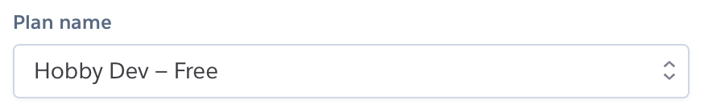
10. Navigate to **Settings** and click on **Reveal Config Vars**.
11. Ensure the following are set:
*\*for guidance on where to obtain these values click [here](#guidance)*
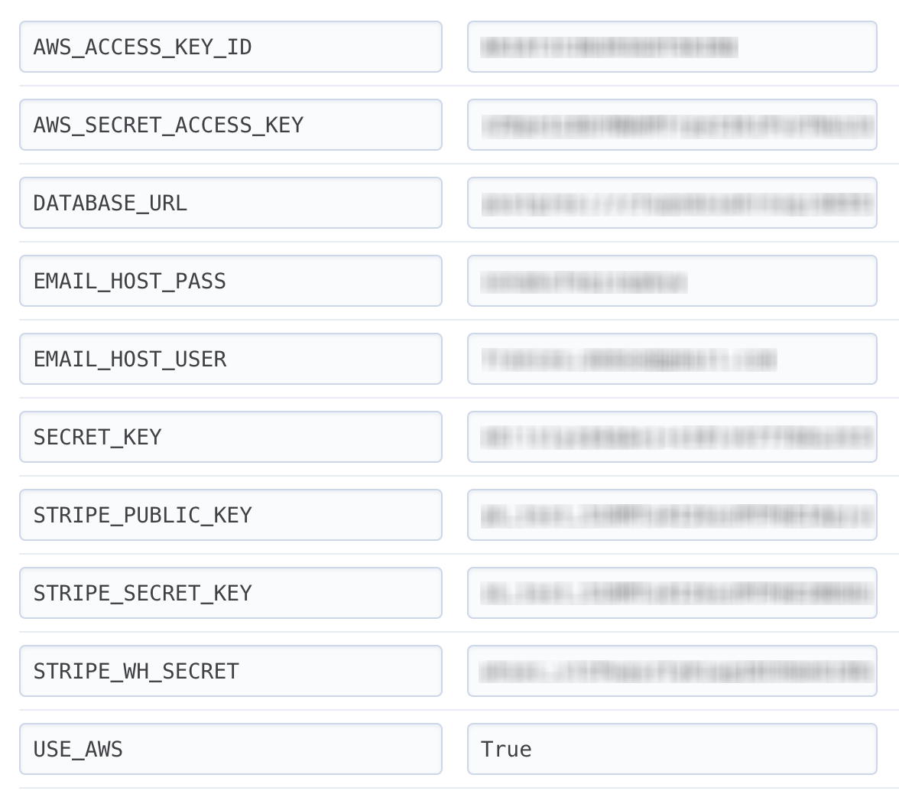

- - -

\#\# Guidance
AWS\_ACCESS\_KEY\_ID:
AWS\_SECRET\_ACCESS\_KEY:
DATABASE\_URL *(for production)*
EMAIL\_HOST\_USER:
EMAIL\_HOST\_PASS (steps are based on gmail server):
SECRET\_KEY:
STRIPE\_PUBLIC\_KEY:
STRIPE\_SECRET\_KEY:
STRIPE\_WH\_SECRET:
USE\_AWS:

- - -

* Set this to True

> Remember to append the path for the checkout to the end of the url, including the trailing '/': `/checkout/wh/`

```
  * Install ngrok. (On MacOs, `brew install ngrok`)
  * Type `ngrok http  8000` in the terminal
  * Add the temporary server address to ALLOWED\_HOSTS in the app settings eg. `[“9e96e1506ea8.ngrok.io”, “127.0.0.1”]`
```

* Click the link alternative to **'receive all events'** in the 'Events to send' section and then 'Add endpoint'
    * Copy the Signing secret provided.
    * As above
    * Copy the Secret Key token
    * Create an account / Sign in to Stripe
    * From the side menu, click on **Developers** > **API Keys**
    * Copy the Publishable Key token
    * Type `python3` in the terminal and then type `import secrets` and hit enter. Type `secrets.token_urlsafe(48)` to generate a secure randomized byte string containing 48 bytes.
    * Sign in to gmail and go to **Settings** > *See all settings*.
    * Navigate to **Accounts & Import** > **Other Google Account Settings.**
    * From the side menu, click on **Security** and follow the steps to turn on 2-Step Verification.
    * Click on **App Passwords**, choose 'Mail' from the first dropdown and 'other' from the second, giving it a reference i.e 'Django'
    * Your gmail account address
    * This value is pre-populated by Heroku in the Config Vars. Alternatively, you can type `Heroku config` in the CLI
    * As above
    * copy the Secret Access Key
    * Create an account / Sign in to AWS and navigate to the **AWS Management Console**
    * Search for S3 in AWS Services and **Create a bucket**. Follow the AWS [documentation.](https://docs.aws.amazon.com/AmazonS3/latest/user-guide/create-configure-bucket.html)
    * Create a User via the IAM service provided by aws
    * As above
    * From the side menu, click on **Developers** > **Webhooks**
    * Click on button to '+ Add endpoint'.
    * Provide your endpoint url. If you are working locally, you may need to take these extra steps for a temporary url:

12. Migrate changes to the database models
13. Commit any changes to GitHub (master branch) and deploy to Heroku. If this is not set to happen automatically, click **Deploy** from Heroku dashboard and navigate to **Manual Deploy** at the bottom of the page. Select the master branch and click **Deploy Branch**.
14. Once the build is complete, click on **Open app** to view the site.

# Bugs <a name="bugs"></a>

1. Circular import issue.
**Cause:** I initially listed the 'Trip' model within the products app. I imported the 'Booking' model from the bookings app so that I could place an aggregate Query on the Booking objects and use the data returned to update the trip object. In the bookings app, I required the Trip model to be imported and used as a positional argument in a ForeignKey within the Booking model. This resulted in a circular import and caused an Import Error.
**Solution:** There were a couple of solutions to this issue. One option was to use lazy evaluation and pass products.Trip as a string in the ForeignKey, instead of just defining the model name. This would the alleviate the need to create an import. However, I did not want to use a lazy lookup so as to protect the app's performance. Instead, I reconsidered the arrangement of the models within the app and was able to solve the issue quite easily by moving the Trip model to the booking app and updating the imports as necessary.
2. 'NoneType' object has no attribute 'model'
**Cause:** When the DateChoiceForm is initialised, the queryset attribute on the ModelChoiceField is overidden with a dynamically generated queryset passed in the \*\*kwargs. If no key is found in the \*\*kwargs, the default value returned is None.
The DateChoiceForm is instantiated again with request.POST when it comes to retrieving the form's POST data. The problem was that the paramater required to initialise the form was not provided. Therefore the kwarg was taking the fallback value of None and subsequently setting the value of the queryset to None.
**Solution:** I refactored the code so that a view that renders a form in it's get method also handles the form's POST data in it's post method. Since the DateChoiceForm is dynamically rendered using data from the SearchTripsForm, I passed the SearchTripForm's input values to the session so that it could be accessed from the view associated with the DateChoiceForm. Within this view, I created a series of custom class methods to retrieve the data from the session and generate a queryset with it. The class methods were available to view's default get and post method which meant that the DateChoiceForm could be inititalised with the same queryset in both the post and get methods.
3. User model imported from django.contrib.auth.models
This error has been reported [See here](https://github.com/PyCQA/pylint-django/issues/278)

# Credits

## Content

The flow of the form was inspired by [Kenmore Air](https://www.kenmoreair.com)

## Media

The majority of images used in this project were sourced from Pexels. Thanks to [Pixabay](https://www.pexels.com/@pixabay)

## Code

* The [Try DJANGO Tutorial](https://www.youtube.com/watch?v=6oOHlcHkX2U&list=PLEsfXFp6DpzTD1BD1aWNxS2Ep06vIkaeW&index=23) youtube series *(Episode 23-28)*, by Coding Entrepreneurs helped me understand the advantages of Django Forms
* [HTML5 Date Input With Django Forms](https://www.youtube.com/watch?v=I2-JYxnSiB0) by Pretty Printed
* [Inline Formsets](https://dev.to/zxenia/django-inline-formsets-with-class-based-views-and-crispy-forms-14o6)
* 
* Stack overflow
[For forms](https://stackoverflow.com/questions/34781524/django-populate-a-form-choicefield-field-from-a-queryset-and-relate-the-choice-b)
* I based my booking form which used inline\_formets to created a nested fomm, on [this](https://swapps.com/blog/working-with-nested-forms-with-django/) walkthrough tutorial from Swapps.